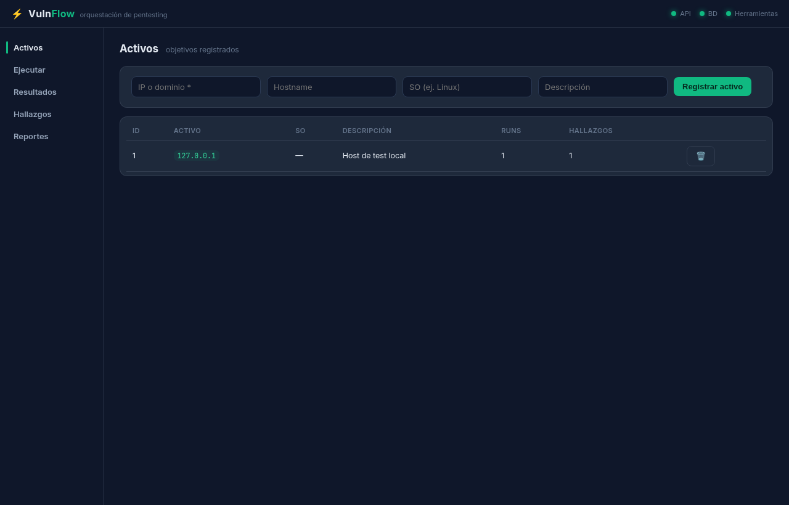
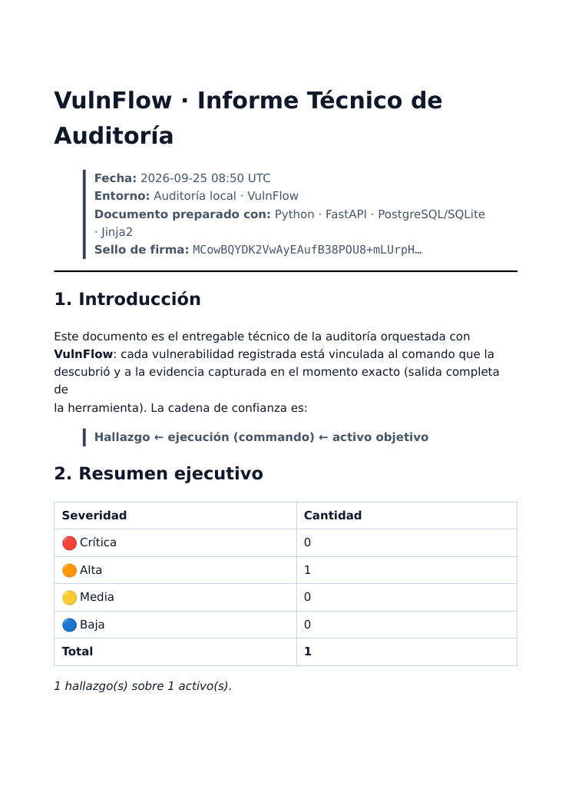

<div align="center">

# ⚡ VulnFlow

**Orquestación de pentesting · el cerebro que documenta por ti**

Lanza tus herramientas contra un activo autorizado, **marca** qué parte de la salida
es un hallazgo y recibe al instante un informe técnico **Markdown + PDF firmado digitalmente**,
sin abrir diez terminales ni pegar nada a mano.

[](https://www.python.org)
[](https://fastapi.tiangolo.com)
[](https://www.postgresql.org)
[](https://www.sqlite.org)
[]()

> ⚠️ Herramienta para **uso autorizado**: audita solo contra objetivos que tengas permiso
> explícito. Toda ejecución queda registrada (comando + evidencia) en el informe.

---

## 🖥️ El panel Block-Dark

Panel web **100% offline** (sin CDN, tipografías vendidas, dark-mode minimalista) integrado
en el propio agente. Registra activos, lanza módulos, ve la salida en crudo y **selecciona
el texto que es evidencia**:

<p align="center">
  
</p>

Y cada hallazgo queda enganchado a su comando y a su evidencia dentro de un **informe técnico
profesional**, exportable a PDF y **firmado con Ed25519** (cualquier manipulación posterior
se detecta):

<p align="center">
  
</p>

---

## 🧠 ¿Por qué VulnFlow?

> **VulnFlow no es un escáner, es un cerebro.** No multiplica terminales: las centraliza
> y convierte su salida en documentación de auditoría de forma automática.

| Sin VulnFlow 😩 | Con VulnFlow ⚡ |
|---|---|
| Abres 10 terminales y copias a mano | Todos los comandos se registran solos |
| Pegas salidas en Word/Docs | La salida completa se guarda como evidencia |
| Marcas "esto es grave" en tu cabeza | El **marcado** crea el hallazgo con su contexto |
| Escribes el informe al final (ya olvidado) | El informe se genera al vuelo, con firma e integridad |

---

## 🚀 Características

- **🎯 Activos** — registra IP/dominio con SO y descripción; cada uno acumula su historial.
- **🔧 Motor por catálogo** — Nmap (`-sT/-sV/vulners`), Gobuster, ffuf, dig, curl y Metasploit,
  con parámetros **validados** y ejecución sin shell (imposible inyección de comandos).
- **✂️ Marcado mágico** — selecciona el fragmento de la salida que es evidencia y VulnFlow
  lo convierte en un hallazgo `severity + título + remediación` vinculado a su ejecución.
- **📄 Reportes automáticos** — Jinja2 → Markdown técnico con resumen ejecutivo, detalle por
  activo, evidencias en crudo y apéndice de integridad → **PDF**.
- **🔏 Firma digital** — Ed25519 por documento; verificable con un comando o desde el panel.
- **🗃️ PostgreSQL *o* SQLite** — BD portátil: si el contenedor cae, la herramienta sigue
  funcionando sobre SQLite y arranca igualmente.
- **🌐 Sugerencia de CVEs (NVD)** — al marcar un hallazgo y en el enriquecimiento del informe;
  degrada a `[]` sin internet, no rompe el flujo.

---

## 🏗️ Arquitectura

```
┌──────────────┐  ① lanza           ┌─────────────────┐  ② argv validado    ┌─────────────┐
│  Panel Web   │ ─────────────────► │  Agente ASGI    │ ────────────────► │ Herramienta │
│  (FastAPI)   │   POST /scans      │  :8002          │  subprocess NO-shell│ Nmap, ffuf…│
└──────┬───────┘                    └───────┬─────────┘                    └─────────────┘
       │ ④ marcar hallazgo                  │ ③ salida completa
       ▼                                    ▼ data/evidence/run_*/output.txt (+.xml)
   ┌────────────────────────────────────────────────────┐
   │ PostgreSQL 16 :5434  (fallback: SQLite)            │
   │   Target 1─n ToolRun 1─n Finding 1─n Evidence      │
   └────────────────────────┬───────────────────────────┘
                            ▼ ⑤ Jinja2 + PDF + firma Ed25519
              data/reports/report_*.md  (+ .pdf + .sig)
```

**Cadena de confianza del informe:**

```
Hallazgo  →  ejecución (comando)  →  activo objetivo  →  evidencia en crudo  →  hash firmado
```

---

## 🔄 Flujo de trabajo

1. **Activos** — registra `10.10.10.5` (o el target autorizado).
2. **Ejecutar** — elige `Nmap · Servicios y versiones` y pulsa *▶ Ejecutar*.
3. **Capture** — la salida completa se guarda en la BD y se muestra en el panel.
4. **Marking** — seleccionas `80/tcp open http` en la salida y pulsas **✂ Marcar selección**;
   añades severidad, título y remediación (y opcionalmente CVEs de la NVD).
5. **Auto-Doc** — VulnFlow escribe el hallazgo en la DB, persiste la evidencia en disco y lo
   cita en el reporte con su comando exacto.
6. **Reporte** — *Generar* → `report_*.md` + `.pdf` + `.sig`; verifica con ✓ firma o
   `.venv/bin/python verify.py report_*.md`.

---

## 🧰 Stack

| Capa | Tecnología |
|---|---|
| **Lenguaje** | Python 3.11+ (probado en 3.14) |
| **API** | FastAPI · Uvicorn |
| **Persistencia** | SQLAlchemy 2 · **PostgreSQL 16** (Docker `:5434`) · fallback **SQLite** |
| **Ejecución** | `subprocess` sin shell · timeout duro (`killpg`) |
| **Reportes** | Jinja2 · Markdown · WeasyPrint (PDF) |
| **Firma** | `cryptography` · Ed25519 |
| **CVEs** | NVD REST API v2 |
| **Frontend** | HTML/CSS/JS vanilla · dark-minimal · **offline** (Inter + JetBrains Mono vendidas) |

---

## 🚦 Quickstart

```bash
git clone git@github.com:TU_USUARIO/VulnFlow.git && cd VulnFlow

./instalar.sh                 # ① venv + dependencias
./infra/levantar-db.sh up -d  # ② PostgreSQL 16 → :5434  (opcional: fallback SQLite)

./arrancar.sh start           # ③ panel → http://127.0.0.1:8002/
.venv/bin/python seed.py      # ④ demo: activo 127.0.0.1 + 2 ejecuciones
```

Control:

```bash
./arrancar.sh start|stop|status|log
./infra/levantar-db.sh up|down|ps|logs
```

---

## 🛠️ Módulos del catálogo

| Módulo | Herramienta | Categoría | Notas |
|---|---|---|---|
| `nmap_ports` / `nmap_services` / `nmap_vuln` | **nmap** | Recon./Vuln | `-sT -Pn`; `-sV` y `--script vulners,vuln`; `-oX` para parseo estructurado |
| `gobuster_dir` | **gobuster** | Capa web | URL + wordlist + códigos de estado |
| `ffuf_vhost` | **ffuf** | Capa web | URL con `FUZZ` + wordlist + `-mc` |
| `dig_dns` | **dig** | Reconocimiento | A/AAAA/MX/NS/TXT/CNAME |
| `curl_http` | **curl** | Capa web | Cabeceras y cuerpo de un endpoint |
| `msfconsole` | **Metasploit** | Explotación | `-q -x <script>` · solo con `VULNFLOW_ALLOW_RAW=1` |

Herramientas ausentes en el PATH se muestran deshabilitadas y devuelven `400` al intentarlas
(nunca un fallo silencioso).

---

## 🔌 API (resumen)

| Método | Ruta | Descripción |
|---|---|---|
| `GET/POST/DELETE` | `/targets` · `/targets/{id}` | CRUD de activos |
| `GET` | `/scans/tools` | Catálogo + disponibilidad real |
| `POST` | `/scans` | Ejecuta un módulo contra un activo |
| `GET` | `/scans` · `/scans/{id}` | Historial y detalle (con salida) |
| `POST` | `/findings` | **Marcar hallazgo** (run + evidencia + CVEs) |
| `GET` | `/findings` · `POST /findings/cves/suggest` | Listado y sugerencia CVE |
| `POST` | `/reports` | Genera Markdown + PDF + firma |
| `GET` | `/reports` · `/reports/{n}/verify` | Descarga y verificación de firma |
| `GET` | `/health` | Estado: BD real, almacenamiento, herramientas |

Swagger interactivo en `http://127.0.0.1:8002/docs`.

---

## 🔒 Seguridad por diseño

- **Sin `shell=True`**: los parámetros jamás tocan un shell → inyección imposible.
- **Catálogo cerrado**: cada herramienta tiene su `builder` de argv validado; no hay
  "ejecutar lo que escriba el usuario" salvo el módulo `msfconsole`, gateado por switch.
- **Timeout estricto** con proceso nuevo (grupo propio) y `killpg` — no deja huérfanos.
- **Validación** de IP/dominio, rangos de puertos y wordlists en la capa de entrada.
- **Firma de integridad**: el hash del reporte cubre el fichero exacto que se entrega.

---

## 📁 Estructura

```
VulnFlow/
├── core/               # el cerebro: executor, parser (nmap-XML), NVD, signer, reporter
├── api/                # FastAPI: main + rutas (targets, scans, findings, reports)
├── ui/                 # panel web offline (index.html, static/, fonts/)
├── templates/          # plantilla Jinja2 del informe
├── infra/              # docker-compose (PostgreSQL 16 :5434) + levantar-db.sh
├── data/               # runtime (gitignored): evidence/, reports/, keys/, sqlite
├── instalar.sh · arrancar.sh · seed.py · verify.py
└── README.md · AGENTS.md
```

---

## ⚖️ Nota legal

Proyecto **educativo**. Pensado para laboratorios y entornos controlados: escanea, explota y
documenta únicamente sistemas sobre los que tengas autorización por escrito. El autor no se
hace responsable del uso indebido de esta herramienta.

---

<div align="center">
  <sub>Hecho con ⚡ para auditorías que dejan huella documentada · `oscp-grade`, no atajos</sub>
</div>